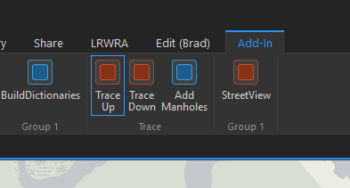
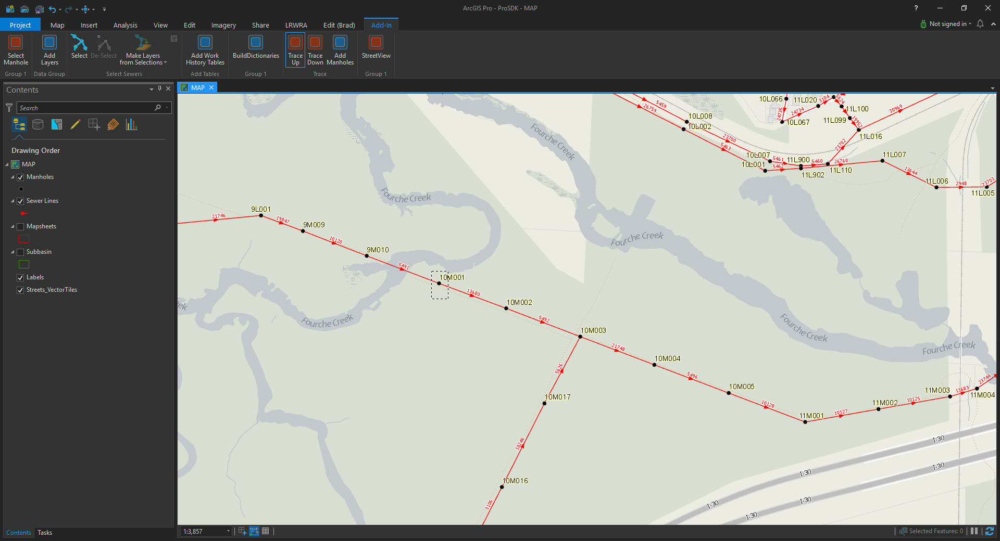
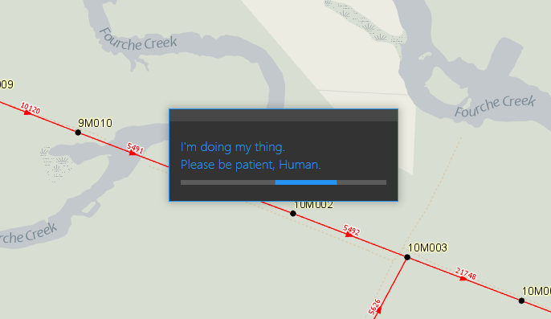
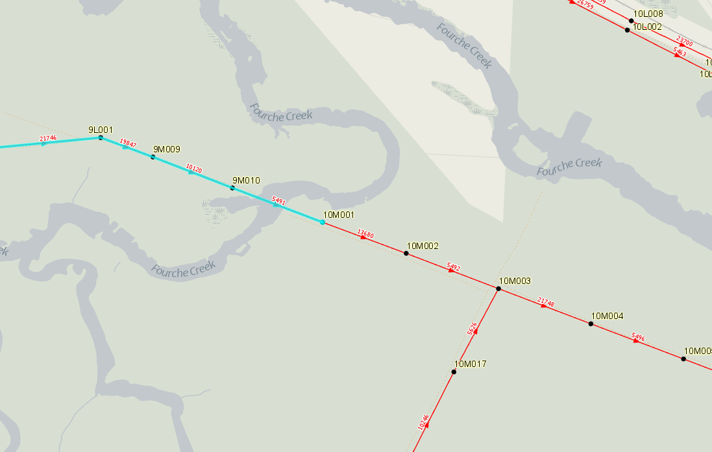
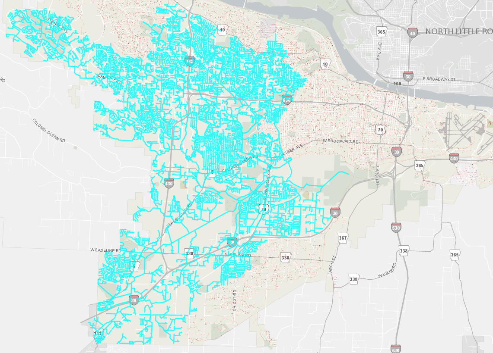
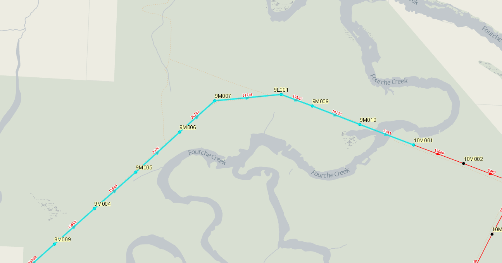

---

---

# **ArcGIS-Pro-Trace**

An ArcGIS Pro add-in that traces and selects sewer lines upstream, or downstream, base on a selected manhole/node. 

There is limited support for Geometric Networks (GN) in ArcGIS Pro.  You can view GN in ArcGIS Pro, but you cannot edit or trace. 

These tools work without using GN.  Each arc is attributed with upstream and downstream node fields. Reference dictionaries are created when the tool is activated (each with >37000 keys).  These are used to get the required up/down node and associated arcs.  Then, through populating a series of working dictionaries and lists, a query string is built and used in a query filter to select the appropriate arcs. 

Credit for coming up with this approach goes to my supervisor, *Mark Drew*. 

This tool is also apart of the larger [LRWRA add-in](https://github.com/dogwoodgeo/ArcGIS-Pro-LRWRA) 

**Update**: Fixed a major bug.  Trace tool would hang-up going between upstream and downstream traces. It appeared to be a process memory issue since two reference dictionaries with ~38,000 elements are created when each trace tool is activated. I simply cleared the dictionaries in the beginning of the  *BuildDictionariesAsync*.

**Note**: I am a novice .Net developer.  The add-in works, but feel free to let me know if you see any code that is "wrong" or just plain bad.  

## Getting Started

Clone or download the repository. Open Visual Studio 2015 or 2017, build solution, launch ArcGIS Pro and check the **Add-Ins** tab.

### Prerequisites

```c#
Language:		C#
Contributor:	 Bradley Jones, bjones@dogwoodgeo.com
Organization:	 Little Rock Water Reclamation Authority (LRWRA)
Org Site: 		https://git.lrwu.com/portal
Date:			10/31/2018
ArcGIS Pro:		2.2
ArcGIS Pro SDK:	 2.2
Visual Studio: 	 2017, 2015
.NET Target:	 4.6.1
```

### How To Use Add-In

**NOTE:** The tools in this add-in will only work on the layers if they are named "Manholes" and "Sewer Lines."

1. Build add-in (see **Getting Started**)
2. Launch ArcGIS Pro.
3. Go to **Add-In** tab.

#### Trace Up/Down

1. Activate the **Trace Up** or **Trace Down** tool. At this point the the tool will check if the **Manholes** and **Sewer Lines** layers are in the map, Manholes layer will be set to be the only selectable layer, and the reference dictionaries will be built (takes about 5 seconds).

   

2. Click and drag to draw a rectangle around the manhole/node you wish to trace from. 

   

3. Selection process will run.

   

4. Upstream/downstream arcs are selected.

   

   

#### Add Manholes

1. Click the **Add Manholes** button to select manholes/nodes associated with trace.

2. Associated manholes are selected.

   


